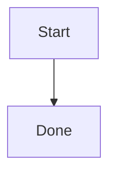

# Fence Language Tags

Common lowercase tags:

```bash
npm test
```

```javascript
const value = "alpha";
console.log(value);
```

```json
{ "name": "markdown-oxc-spike", "private": true }
```

Alias and mixed-case tags:

```js
const list = ["alpha", "beta"];
```

```TypeScript
const typed: string = "value";
```

Tags with extra info strings:

```python linenums="1"
print("hello")
```


